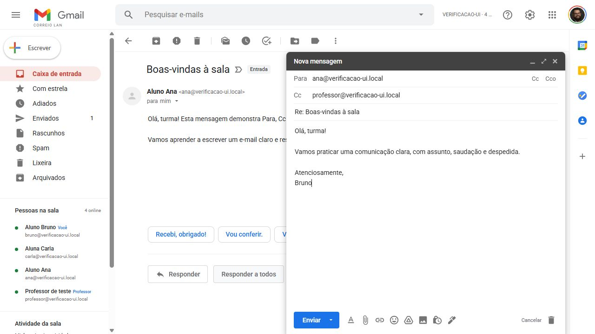

# Entrega do CORREIO LAN

Implementação de frontend e backend no mesmo projeto, com Node.js 24, Express 5, HTML/CSS/JavaScript vanilla, REST e polling HTTP. Estado em memória, sem banco de dados. `server.js` é o entry point; `npm start` executa `node server.js` e usa a porta do ambiente. O frontend usa caminhos relativos `/api`, compatíveis com Hostinger Web app Node.js.

## Funcionalidades entregues

- Entrada em sala normalizada, endereço `.local`, identificadores únicos, token aleatório por sessão e recuperação na mesma aba.
- Presença com heartbeat, estados online/offline, lista ativa e limpeza de salas e sessões.
- Composição, autocomplete, Para/CC/CCO, envio, recebimento e sincronização incremental.
- Caixa de entrada, enviados, leitura individual, estrelas, arquivo, spam, adiamento, busca e paginação.
- Responder, responder a todos, encaminhar texto/anexos, rascunhos locais, lixeira, restauração e exclusão da própria cópia.
- Anexos temporários com validação de formato/conteúdo, limites e download privado.
- Notificações internas e som opcional, desligado por padrão.
- Um professor por sala, publicação de atividade e painel agregado de entregas, incluindo participantes offline e entradas tardias.
- Layout baseado no Gmail UI kit fornecido, com assets exportados do Figma, fontes locais, adaptações pedagógicas e navegação responsiva.
- Validações, limites por IP/sessão, proteção de endpoints, cabeçalhos de segurança e erros padronizados.

## Arquivos

Todos os arquivos da aplicação foram criados: o diretório estava vazio inicialmente. Durante a implementação foram ajustados os novos arquivos para conectar as funcionalidades e corrigir os problemas encontrados nos testes.

| Grupo | Arquivos |
| --- | --- |
| Raiz | `server.js`, `package.json`, `package-lock.json`, `.nvmrc`, `.env.example`, `.gitignore`, `.gitattributes`, `README.md`, `THIRD_PARTY_NOTICES.md` |
| Backend | `src/app.js`, `src/config.js`, rotas de salas/mensagens/atividades, serviços de sala/mensagem/anexo/atividade, `MemoryStore`, rate limit e utilitários |
| Frontend | `public/index.html`, `public/app.html`, `public/css/correio-lan.css`, seis módulos em `public/js/`, assets Figma/fontes e suas licenças |
| Verificação | `scripts/check.js`, testes de salas/mensagens/ações/anexos/integração e fixtures pequenas de arquivos válidos |
| Documentação | `docs/API.md`, este resumo e captura da interface |
| CI | `.github/workflows/ci.yml` executa verificação e testes no Node.js 24 |

A lista dos endpoints e formatos está em [API.md](API.md). A preparação de GitHub, instalação local, testes com vários alunos, configurações e passos de Hostinger estão no [README](../README.md).

## Verificação executada

`npm test`: **19 testes passaram**, incluindo turma HTTP com 30 alunos, professor, entrada tardia, entrega de atividade, offline, reconexão, expiração, limites, isolamento entre salas, CCO seguro em detalhe/lista/enviados/sync e downloads privados. Arquivos válidos PDF/PNG/JPG/TXT/DOCX foram aceitos; os casos de MIME falso, arquivo proibido, tamanho/quantidade acima do limite e acesso indevido foram rejeitados. `npm run check` verificou a sintaxe de todos os módulos JavaScript.

O servidor foi iniciado localmente e `/api/health` respondeu `data.status: "ok"`. A interface foi verificada pelo navegador com Ana, Bruno, Carla e um professor na mesma sala e um visitante em outra sala. Foram exercitados envio com CC/CCO, leitura, resposta a todos sem CCO, rascunho recuperado após atualizar, entrega da atividade, lixeira/restauração e saída. Não foram identificados erros de console da aplicação ou imagens quebradas. Em largura de 390 px, o compositor ocupou a largura disponível e não houve overflow horizontal do documento. A emulação foi removida após o teste.

## Operação e próximos passos

Local: `npm ci`, `npm start` e [http://localhost:3000](http://localhost:3000). Para turmas, use nomes de sala iguais e sessões de navegador distintas. Na Hostinger: Express, Node 24, raiz `.`, entry point `server.js`, startup `npm start`, `NODE_ENV=production`, porta fornecida pela plataforma e um único processo. A implantação no hPanel depende da conexão do repositório e da configuração do plano/domínio.

Dados não sobrevivem a reinícios ou novos deploys. O papel professor é uma seleção pedagógica sem autenticação institucional. Não há entrega a endereços externos. Rascunhos e arquivos selecionados dependem da aba; arquivos precisam ser selecionados novamente após atualizar. Melhoria futura: adaptar o repositório de memória para MySQL, acrescentar autenticação, retenção e armazenamento permanente de anexos. Nenhuma dessas dependências foi introduzida nesta versão.
